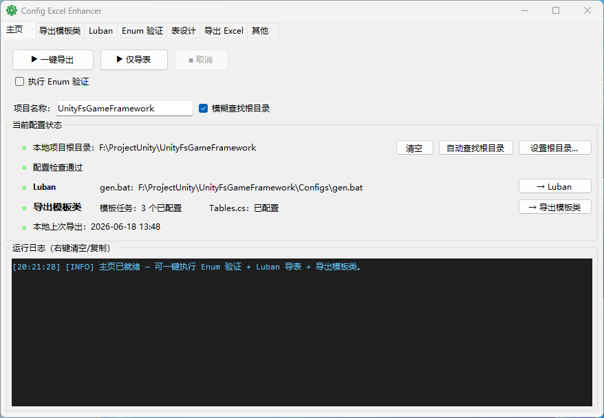
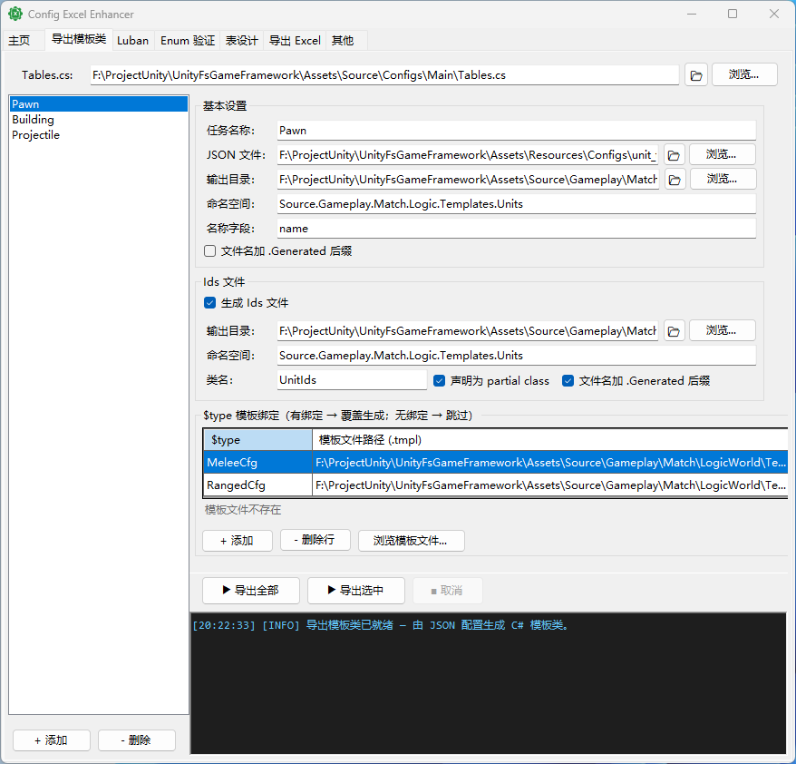
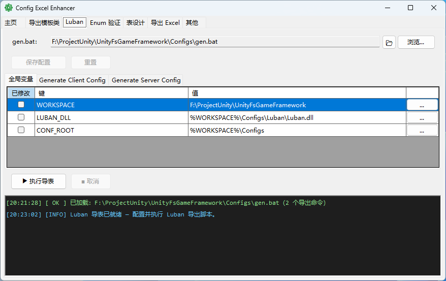
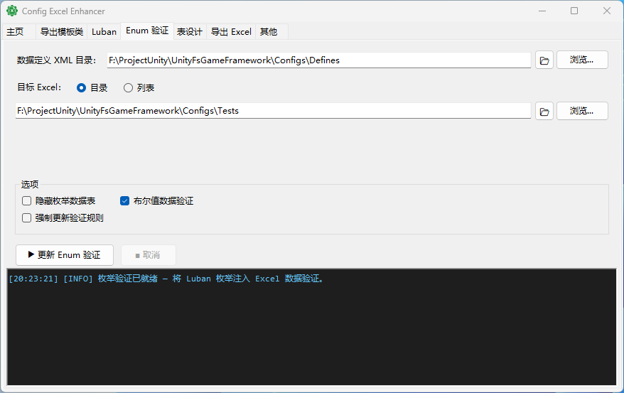
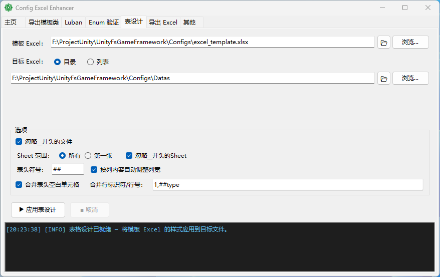
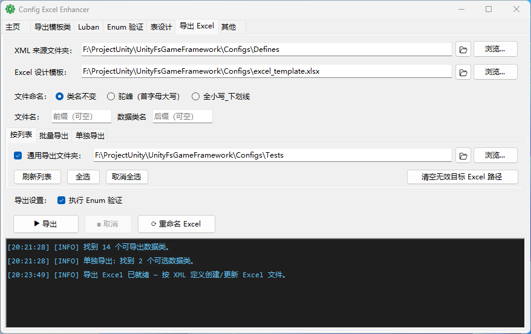

# Config Excel Enhancer

`Config Excel Enhancer` 是配合 [Luban](https://www.datable.cn/docs/intro) 配置框架使用的 Excel 配置表增强工具。
它提供了配置表编辑和导出时的各种常用功能：一键导出、导出模板类、Luban 设置、Enum 数据验证、表设计、导出 Excel。

## 📜 目录
- [主页](#主页)
- [导出模板类](#导出模板类)
- [Luban](#luban)
- [Enum 验证](#enum-验证)
- [表设计](#表设计)
- [导出 Excel](#导出-excel)
- [其他](#其他)

## 主页
提供了`一键导出`功能，点击后会使用配置的 gen.bat 来导出配置表数据。根据配置的模板类自动生成模板类代码。进行 Enum 验证设置（可选）。  

 

## 导出模板类
在项目中，我们需要使用代码来访问配置表数据。  
常见的使用方式是，定义了 PawnCfg 士兵配置类，然后在运行时为各种士兵读取配置数据。  
此时使用导出模板类功能，可以根据配置表数据和模板自动生成模板类代码，避免了手动编写模板类的麻烦。  
如图定义了 Pawn 模板任务来根据 TbPawn 配置表生成各种士兵配置类的模板类代码。  



模板代码如下，像`{{$ClassName}}`这样的占位符会在导出时被替换成具体的值。占位符的数据来源是模板任务中的配置，以及 Tables.cs 中的数据。
```csharp
// =========================================================================================
// 模板占位符说明（由 ConfigExcelEnhancer 导出工具在运行时替换）
// =========================================================================================
// {{$ClassName}}       — 单位名称，来自 JSON name 字段，已转为 PascalCase
//                        示例：Saber、Giant、Archer
// {{$CfgType}}         — Luban 配置类型名，来自 JSON $type 字段
//                        示例：MeleeCfg、RangedCfg
// {{$LubanNamespace}}  — Luban 生成类的命名空间，由 Tables.cs 自动推断
//                        示例：cfg.Unit
// {{$TableAccessor}}   — Tables 静态访问器，由 Tables.cs 自动推断
//                        示例：Config.Tables.TbPawn
// {{$Namespace}}       — 生成类的 C# 命名空间，在任务配置中指定
//                        示例：Source.Gameplay.Match.Logic.Templates.Units
// {{$Ids}}             — 生成工具中指定的 Ids 类名，通常由用户在任务配置中指定，需包含所有单位 Id 定义
//                        示例：UnitIds.Saber、UnitIds.Giant、UnitIds.Archer
// =========================================================================================

using {{$LubanNamespace}};
using FixedMathSharp;
using Source.Gameplay.Match.Logic.Components;
using EAttackMode = Source.Gameplay.Match.Logic.Components.EAttackMode;
using EMoveType = Source.Gameplay.GridMapSystem.Data.EMoveType;
using MeleeAttackStats = Source.Gameplay.Match.Logic.Components.MeleeAttackStats;
using SteeringStats = Source.Gameplay.Match.Logic.Components.SteeringStats;
using TargetSearchStats = Source.Gameplay.Match.Logic.Components.TargetSearchStats;
using TargetStickyMode = Source.Gameplay.Match.Logic.Components.TargetStickyMode;
using TargetFilter = Source.Gameplay.Match.Logic.Components.TargetFilter;

namespace {{$Namespace}}
{
    /// <summary>{{$ClassName}} 数值模板。</summary>
    public sealed class {{$ClassName}} : IUnitTemplateProvider
    {
        public static readonly {{$ClassName}} Instance = new();
        // 静态构造器：类型首次被访问时自动向注册表注册
        static {{$ClassName}}() => UnitTemplateManager.Register(Instance);
        private {{$ClassName}}() { }

        public {{$CfgType}} Cfg => {{$TableAccessor}}.Get(UnitId()) as {{$CfgType}};
        
        public int UnitId() => {{$Ids}}.{{$ClassName}};
        
        public string Name() => Cfg.Name;
        
        public EMoveType GetMoveType() => (EMoveType)Cfg.MoveType;
        
        public EAttackMode GetAttackMode() => (EAttackMode)Cfg.AttackMode;

        public UnitStats GetStats() => new UnitStats
        {
            MaxHp               = new Fixed64(Cfg.MaxHp),
            CurrentHealth       = new Fixed64(Cfg.MaxHp),
            AttackBaseDamage    = new Fixed64(Cfg.AttackBaseDamage),
            AttackInterval      = new Fixed64(Cfg.AttackInterval) / new Fixed64(100),
            SearchRange         = new Fixed64(Cfg.SearchRange) / new Fixed64(10),
            CollisionRadius     = new Fixed64(Cfg.CollisionRadius) / new Fixed64(10),
        };
        
        public Fixed64 GetFlowFieldEngageRange() => new Fixed64(Cfg.FlowFieldEngageRange) / new Fixed64(10);
        
        public bool IsWithoutFlowField() => Cfg.IsWithoutFlowField;
        
        public SteeringStats GetSteering() => new SteeringStats
        {
            MaxSpeed             = new Fixed64(Cfg.SteeringStats.MaxSpeed) / new Fixed64(10),
            MaxForce             = new Fixed64(Cfg.SteeringStats.MaxForce) / new Fixed64(10),
            Mass                 = new Fixed64(Cfg.SteeringStats.Mass) / new Fixed64(10),
            SeekWeight           = new Fixed64(Cfg.SteeringStats.SeekWeight) / new Fixed64(10),
            SeparationWeight     = new Fixed64(Cfg.SteeringStats.SeparationWeight) / new Fixed64(10),
            AvoidanceWeight      = new Fixed64(Cfg.SteeringStats.AvoidanceWeight) / new Fixed64(10),
            UnitAvoidanceWeight  = new Fixed64(Cfg.SteeringStats.UnitAvoidanceWeight) / new Fixed64(10),
            RetreatWeight        = new Fixed64(Cfg.SteeringStats.RetreatWeight) / new Fixed64(10),
            TangentialSepWeight  = new Fixed64(Cfg.SteeringStats.TangentialSepWeight) / new Fixed64(10),
        };

        public TargetSearchStats GetTargetSearch() => new TargetSearchStats
        {
            StickyMode         = (TargetStickyMode)Cfg.TargetSearchStats.StickyMode,
            Tier0              = new TargetPriorityTier((TargetFilter)Cfg.TargetSearchStats.Tier0Filter, Cfg.TargetSearchStats.Tier0Value),
            Tier1              = new TargetPriorityTier((TargetFilter)Cfg.TargetSearchStats.Tier1Filter, Cfg.TargetSearchStats.Tier1Value),
            Tier2              = new TargetPriorityTier((TargetFilter)Cfg.TargetSearchStats.Tier2Filter, Cfg.TargetSearchStats.Tier2Value),
            Tier3              = new TargetPriorityTier((TargetFilter)Cfg.TargetSearchStats.Tier3Filter, Cfg.TargetSearchStats.Tier3Value),
            DistanceWeight     = (byte)Cfg.TargetSearchStats.DistanceWeight,
            AngleWeight        = (byte)Cfg.TargetSearchStats.AngleWeight,
            ToleranceFraction  = new Fixed64(Cfg.TargetSearchStats.ToleranceFraction) / new Fixed64(1000),
        };

        public MeleeAttackStats GetMeleeAttack() => new MeleeAttackStats
        {
            AttackRange      = new Fixed64(Cfg.MeleeAttackStats.AttackRange) / new Fixed64(10),
            ChaseRange       = Cfg.MeleeAttackStats.ChaseRange == -1 ?
                AttackData.ChaseRangeDefault(new Fixed64(Cfg.MeleeAttackStats.AttackRange) / new Fixed64(10))
                : new Fixed64(Cfg.MeleeAttackStats.ChaseRange) / new Fixed64(10),
            ChaseRangeInner  = Cfg.MeleeAttackStats.ChaseRangeInner == -1 ?
                AttackData.ChaseRangeInnerDefault(new Fixed64(Cfg.MeleeAttackStats.AttackRange) / new Fixed64(10))
                : new Fixed64(Cfg.MeleeAttackStats.ChaseRangeInner) / new Fixed64(10),
        };
    }
}
```

导出的模板类如下
```csharp
// <auto-generated>
//   此文件由 ConfigExcelEnhancer 自动生成，请勿手动修改。
//   手动修改将在下次导出时被覆盖。
//   生成时间：2026-05-20 21:50:59
//   来源工具：ConfigExcelEnhancer (https://github.com/blurfeng/config-excel-enhancer)
// </auto-generated>
// =========================================================================================
// 模板占位符说明（由 ConfigExcelEnhancer 导出工具在运行时替换）
// =========================================================================================
// Saber       — 单位名称，来自 JSON name 字段，已转为 PascalCase
//                        示例：Saber、Giant、Archer
// MeleeCfg         — Luban 配置类型名，来自 JSON $type 字段
//                        示例：MeleeCfg、RangedCfg
// cfg.Unit  — Luban 生成类的命名空间，由 Tables.cs 自动推断
//                        示例：cfg.Unit
// Config.Tables.TbPawn   — Tables 静态访问器，由 Tables.cs 自动推断
//                        示例：Config.Tables.TbPawn
// Source.Gameplay.Match.Logic.Templates.Units       — 生成类的 C# 命名空间，在任务配置中指定
//                        示例：Source.Gameplay.Match.Logic.Templates.Units
// UnitIds             — 生成工具中指定的 Ids 类名，通常由用户在任务配置中指定，需包含所有单位 Id 定义
//                        示例：UnitIds.Saber、UnitIds.Giant、UnitIds.Archer
// =========================================================================================

using cfg.Unit;
using FixedMathSharp;
using Source.Gameplay.Match.Logic.Components;
using EAttackMode = Source.Gameplay.Match.Logic.Components.EAttackMode;
using EMoveType = Source.Gameplay.GridMapSystem.Data.EMoveType;
using MeleeAttackStats = Source.Gameplay.Match.Logic.Components.MeleeAttackStats;
using SteeringStats = Source.Gameplay.Match.Logic.Components.SteeringStats;
using TargetSearchStats = Source.Gameplay.Match.Logic.Components.TargetSearchStats;
using TargetStickyMode = Source.Gameplay.Match.Logic.Components.TargetStickyMode;
using TargetFilter = Source.Gameplay.Match.Logic.Components.TargetFilter;

namespace Source.Gameplay.Match.Logic.Templates.Units
{
    /// <summary>Saber 数值模板。</summary>
    public sealed class Saber : IUnitTemplateProvider
    {
        public static readonly Saber Instance = new();
        // 静态构造器：类型首次被访问时自动向注册表注册
        static Saber() => UnitTemplateManager.Register(Instance);
        private Saber() { }

        public MeleeCfg Cfg => Config.Tables.TbPawn.Get(UnitId()) as MeleeCfg;
        
        public int UnitId() => UnitIds.Saber;
        
        public string Name() => Cfg.Name;
        
        public EMoveType GetMoveType() => (EMoveType)Cfg.MoveType;
        
        public EAttackMode GetAttackMode() => (EAttackMode)Cfg.AttackMode;

        public UnitStats GetStats() => new UnitStats
        {
            MaxHp               = new Fixed64(Cfg.MaxHp),
            CurrentHealth       = new Fixed64(Cfg.MaxHp),
            AttackBaseDamage    = new Fixed64(Cfg.AttackBaseDamage),
            AttackInterval      = new Fixed64(Cfg.AttackInterval) / new Fixed64(100),
            SearchRange         = new Fixed64(Cfg.SearchRange) / new Fixed64(10),
            CollisionRadius     = new Fixed64(Cfg.CollisionRadius) / new Fixed64(10),
        };
        
        public Fixed64 GetFlowFieldEngageRange() => new Fixed64(Cfg.FlowFieldEngageRange) / new Fixed64(10);
        
        public bool IsWithoutFlowField() => Cfg.IsWithoutFlowField;
        
        public SteeringStats GetSteering() => new SteeringStats
        {
            MaxSpeed             = new Fixed64(Cfg.SteeringStats.MaxSpeed) / new Fixed64(10),
            MaxForce             = new Fixed64(Cfg.SteeringStats.MaxForce) / new Fixed64(10),
            Mass                 = new Fixed64(Cfg.SteeringStats.Mass) / new Fixed64(10),
            SeekWeight           = new Fixed64(Cfg.SteeringStats.SeekWeight) / new Fixed64(10),
            SeparationWeight     = new Fixed64(Cfg.SteeringStats.SeparationWeight) / new Fixed64(10),
            AvoidanceWeight      = new Fixed64(Cfg.SteeringStats.AvoidanceWeight) / new Fixed64(10),
            UnitAvoidanceWeight  = new Fixed64(Cfg.SteeringStats.UnitAvoidanceWeight) / new Fixed64(10),
            RetreatWeight        = new Fixed64(Cfg.SteeringStats.RetreatWeight) / new Fixed64(10),
            TangentialSepWeight  = new Fixed64(Cfg.SteeringStats.TangentialSepWeight) / new Fixed64(10),
        };

        public TargetSearchStats GetTargetSearch() => new TargetSearchStats
        {
            StickyMode         = (TargetStickyMode)Cfg.TargetSearchStats.StickyMode,
            Tier0              = new TargetPriorityTier((TargetFilter)Cfg.TargetSearchStats.Tier0Filter, Cfg.TargetSearchStats.Tier0Value),
            Tier1              = new TargetPriorityTier((TargetFilter)Cfg.TargetSearchStats.Tier1Filter, Cfg.TargetSearchStats.Tier1Value),
            Tier2              = new TargetPriorityTier((TargetFilter)Cfg.TargetSearchStats.Tier2Filter, Cfg.TargetSearchStats.Tier2Value),
            Tier3              = new TargetPriorityTier((TargetFilter)Cfg.TargetSearchStats.Tier3Filter, Cfg.TargetSearchStats.Tier3Value),
            DistanceWeight     = (byte)Cfg.TargetSearchStats.DistanceWeight,
            AngleWeight        = (byte)Cfg.TargetSearchStats.AngleWeight,
            ToleranceFraction  = new Fixed64(Cfg.TargetSearchStats.ToleranceFraction) / new Fixed64(1000),
        };

        public MeleeAttackStats GetMeleeAttack() => new MeleeAttackStats
        {
            AttackRange      = new Fixed64(Cfg.MeleeAttackStats.AttackRange) / new Fixed64(10),
            ChaseRange       = Cfg.MeleeAttackStats.ChaseRange == -1 ?
                AttackData.ChaseRangeDefault(new Fixed64(Cfg.MeleeAttackStats.AttackRange) / new Fixed64(10))
                : new Fixed64(Cfg.MeleeAttackStats.ChaseRange) / new Fixed64(10),
            ChaseRangeInner  = Cfg.MeleeAttackStats.ChaseRangeInner == -1 ?
                AttackData.ChaseRangeInnerDefault(new Fixed64(Cfg.MeleeAttackStats.AttackRange) / new Fixed64(10))
                : new Fixed64(Cfg.MeleeAttackStats.ChaseRangeInner) / new Fixed64(10),
        };
    }
}
```

## Luban
此分页主要配置 gen.bat 所在路径（一键导出时使用）。  
并支持对 gen.bat 中的一些配置进行修改。并保存到 gen.bat 中。比如全局变量和导出参数等。  
只需要导表时，可以点击 `执行导表` 按钮来执行 gen.bat 中的导出命令。  

 

## Enum 验证
提供了自动设置 Excel 配置表中 Enum 列的 Cell 为数据验证（下拉框选择枚举）的功能。  
需要配置 .xml 所在目录，然后回根据 .xml 中定义的 Enum 来查找并设置所有使用了 Enum 类型的列。  
除了定义的 Enum 外，也支持勾选`布尔值数据验证`来自动设置 bool 类型的列为下拉选择 TRUE/FALSE。  
点击`更新Enum验证`按钮后会自动设置 Excel 配置表中 Enum 列的 Cell 为数据验证（下拉框选择枚举）。  

 

## 表设计
提供了将目标 Excel 的表设计应用到指定的 Excel 配置表的功能。  
比如上面示例的 Excel 中，设置了表头行的填充颜色、冻结窗口、表（智能表/超级表）、列宽、行高、字体大小等。  
这些表设计会在保持目标 Excel 数据不变的情况下被应用到指定的 Excel 配置表中。  

 

## 导出 Excel
提供了根据 Luban 的 `.xml`（bean）定义**自动创建或更新** Excel 配置表的功能。  
它会读取数据类（叶子 bean）的字段，生成 Luban 兼容的表头结构（`##var`/`##type`/`##group`/`##` 各行），并将结构体类型的字段自动展开为多列、合并父列。这样就省去了手动按字段定义创建和维护 Excel 表头的麻烦。  

设置项说明：
- **XML 来源文件夹**：扫描该目录下 `.xml` 中定义的数据类（叶子 bean），作为可导出项。
- **Excel 设计模板（可选）**：导出时从该模板复制智能表外观、冻结窗口、列宽、计算列公式等表设计；留空时回退到`表设计`页配置的源表。
- **文件命名**：支持设置文件名`前缀`/`后缀`，以及命名规则（`类名不变`/`驼峰（首字母大写）`/`全小写_下划线`）。

提供了两种导出模式：
- **按列表**：逐项勾选要导出的数据类，并可为每项单独指定目标 Excel 路径；留空的项会使用上方的`通用导出文件夹`，并按文件命名规则生成文件名。
- **批量导出**：把所有数据类一次性导出到同一个`导出文件夹`，按文件命名规则生成各自的文件名（会检查跨 `.xml` 文件的重名并报错）。

其他：
- **执行 Enum 验证（可选）**：勾选后，导出完成会复用`Enum 验证`功能，对导出的 Excel 自动写入枚举（及布尔值）数据验证。
- **非破坏式更新**：当目标文件已存在时，会保留已有数据行，仅做列的新增/删除/保留，并重建表头与智能表；文件被占用时会自动跳过。
- **重命名 Excel**：点击`重命名`按钮，可按当前的文件名`前缀`/`后缀`与命名规则，对已导出的配置表文件批量重命名。重命名前会先构建计划并弹窗预览确认；已正确命名的文件会跳过，命名冲突或无法识别的文件会记录到日志并跳过。

 

## 其他
集中放置配置文件管理与工具信息。

### 配置文件管理
- **settings.json（团队共享）**：保存项目级配置（XML/Excel 目录、导出关联、命名规则等），路径以项目根目录为基准存为相对路径，便于随仓库共享。支持`打开所在文件夹`与`清空`（恢复默认值）。
- **local_state.json（本机私有）**：保存机器本地状态（项目根目录、窗口尺寸、导出缓存等），存绝对路径，不纳入版本管理。支持`打开所在文件夹`与`清空`；清空后需重新设置项目根目录，否则 settings.json 中的相对路径会失去基准。

### 关于
显示工具版本号，并提供 Luban 官方仓库与本项目仓库的链接。

### 诊断信息
展示当前版本、项目根目录、settings.json 与 local_state.json 的实际路径，并支持一键复制，便于反馈问题时提供环境信息。

 